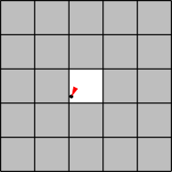
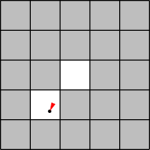
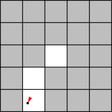
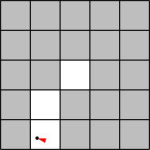
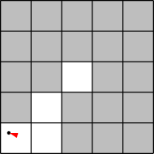

# Simulating Robots

### Introduction

In this problem set you will practice designing a simulation and implementing a program that
uses classes.

Please don’t be discouraged by the apparent length of this problem set. There is quite a bit to
read and understand, but most of the problems do not involve writing much code.

### Getting Started

Download the zip file [here].

[here]: http://ocw.mit.edu/courses/electrical-engineering-and-computer-science/6-00sc-introduction-to-computer-science-and-programming-spring-2011/unit-2/lecture-14-sampling-and-monte-carlo-simulation/ps6.zip

### Graphs & Math

To create plots for Problems #4 and #6 of this problem set, you will need these Python library
packages: 

#### Matplotlib

This is a package for plotting graphs, barcharts and other visual representations of numerical data.

Some [sample images], you can click on the images for the code and the [matplotlib documentation].

[sample images]: matplotlib.org/gallery.html
[matplotlib documentation]: http://matplotlib.org/contents.html

#### Numpy

This is a package for scientific computing, implemented mostly with more efficient/advanced math operations.

An introduction with some [sample code] and the [numpy documentation].

[sample code]: http://scipy.org/Getting_Started
[numpy documentation]: http://docs.scipy.org/doc/

#### Check the packages are installed

All you have to do is verify that these packages are available in your IDLE version (there are multiple versions
on the UvA machines). You can test this by running *ps6_pkgtest.py* or by simply typing

    import matplotlib, numpy

in the Shell, which should not result in any errors.

If you are working on your own machine, you will have to install the packages. You will need

* [matplotlib] Version 1.0.0 or higher
* [numpy] Version 1.5.0 or higher

[matplotlib]: http://matplotlib.org/downloads.html
[numpy]: http://sourceforge.net/projects/numpy/files/NumPy/

### Simulation Overview

iRobot is a company (started by MIT alumni and faculty) that sells the [Roomba vacuuming robot]
(watch one of the product videos to see these robots in action). Roomba robots move about a
floor, cleaning the area they pass over. You will design a simulation to estimate how much time
a group of Roomba-like robots will take to clean the floor of a room.

[Roomba vacuuming robot]: http://store.irobot.com/category/index.jsp?categoryId=3334619&cp=2804605&ab=CMS_IRBT_Storefront_011510_vacuumcleaning

The following simplified model of a single robot moving in a square 5×5 room should give you
some intuition about the system we are simulating.

The robot starts out at some random position in the room, and with a random direction of motion.
The illustrations below show the robot’s position (indicated by a black dot) as well as its
direction (indicated by the direction of the red arrowhead).

Time t = 0: The robot starts at
the position (2.1, 2.2) with an
angle of 205 degrees (measured
clockwise from “north”). The
tile that it is on is now clean.

t = 1: The robot has moved 1
unit in the direction it was
facing, to the position (1.7,
1.3), cleaning another tile.

t = 2: The robot has moved 1
unit in the same direction (205
degrees from north), to the
position (1.2, 0.4), cleaning
another tile.

t = 3: The robot could not have 
moved another unit in the same 
direction without hitting the
wall, so instead it turns to face
in a new, random direction, 287
degrees.

t = 4: The robot moves along
its new heading to the position
(0.3, 0.7), cleaning another tile.

#### Simulation Details

Here are additional details about the simulation model. Read these carefully.

* **Multiple robots** In general, there are N > 0 robots in the room, where N is given. For
simplicity, assume that robots are points and can pass through each other or occupy the
same point without interfering.
* **The room** The room is rectangular with some integer width w and height h, which are
given. Initially the entire floor is dirty. A robot cannot pass through the walls of the room.
A robot may not move to a point outside the room.
* **Robot motion rules**
  * Each robot has a position inside the room. We’ll represent the position using
  coordinates (x, y) which are floats satisfying 0 ≤ x < w and 0 ≤ y < h. In our
  program we’ll use instances of the Position class to store these coordinates.
  * A robot has a direction of motion. We’ll represent the direction using an integer d
  satisfying 0 ≤ d < 360, which gives an angle in degrees.
  * All robots move at the same speed s, which is given and is constant throughout
  the simulation. Every time-step, a robot moves in its direction of motion by s
  units.
  * If a robot would’ve ended up hitting the wall within the time-step, it instead picks
  a new direction at random. The robot continues in that direction until it reaches
  another wall.
* **Tiles** You will need to keep track of which parts of the floor have been cleaned by the
robot(s). We will divide the area of the room into 1×1 tiles (there will be w * hsuch tiles).
When a robot’s location is anywhere in a tile, we will consider the entire tile to be
cleaned (as in the pictures above). By convention, we will refer to the tiles using ordered
pairs of integers: (0, 0), (0, 1), ..., (0, h-1), (1, 0), (1, 1), ..., (w-1, h-1).
* **Termination** The simulation ends when a specified fraction of the tiles in the room have
been cleaned.

If you find any places above where the specification of the simulation dynamics seems
ambiguous, it is up to you to make a reasonable decision about how your program/model will
behave, and document that decision in your code.

## Part I: The Rectangular Room and Robot classes

You will need to design two classes to keep track of which parts of the room have been cleaned
as well as the position and direction of each robot.

In ps6.py, we’ve provided skeletons for the following two classes, which you will fill in in
Problem #1:

**RectangularRoom** Represents the space to be cleaned and keeps track of which tiles have been cleaned.

**Robot** Stores the position and heading of a robot.

We’ve also provided a complete implementation of the following class:

**Position** Stores the x- and y-coordinates of a robot in a room.

**Read ps6.py carefully before starting, so that you understand the provided code and its capabilities.**

#### Problem #1

In this problem you will implement two classes.

For the RectangularRoom class, decide what fields you will use and decide how the following
operations are to be performed:

* Initializing the object
* Marking an appropriate tile as cleaned when a robot moves to a given position
* Determining if a given tile has been cleaned
* Determining how many tiles there are in the room
* Determining how many cleaned tiles there are in the room
* Getting a random position in the room
* Determining if a given position is in the room

For the Robot class, decide what fields you will use and decide how the following operations are
to be performed:

* Initializing the object
* Accessing the robot’s position
* Accessing the robot’s direction
* Setting the robot’s position
* Setting the robot’s direction

Complete the RectangularRoom and Robot classes by implementing their methods
in ps6.py.

(Although this problem has many parts, it should not take long once you have chosen how you
wish to represent your data. For reasonable representations, *a majority of the methods will
require only one line of code.*)

For your reference, here are **abbreviated** specifications for the methods of RectangularRoom
and Robot. See ps6.py for complete details.

    class RectangularRoom(object):
        """
        A RectangularRoom represents a rectangular region containing clean or dirty
        tiles. A room has a width and a height and contains (width * height) tiles. At
        any particular time, each of these tiles is either clean or dirty.
        """
        
        def __init__(self, width, height):
            """
            Initializes a rectangular room with the specified width and height.
            Initially, no tiles in the room have been cleaned.
            """
        
        def cleanTileAtPosition(self, pos):
            """Mark the tile under the position POS as cleaned."""
        
        def isTileCleaned(self, m, n):
            """Return True if the tile (m, n) has been cleaned."""
        
        def getNumTiles(self):
            """Return the total number of tiles in the room."""
        
        def getNumCleanedTiles(self):
            """Return the total number of clean tiles in the room."""
        
        def getRandomPosition(self):
            """Return a random position inside the room."""
        
        def isPositionInRoom(self, pos):
            """Return True if POS is inside the room."""
    
    class Robot(object):
        """
        Represents a robot cleaning a particular room.
        At all times the robot has a particular position and direction in the room.
        The robot also has a fixed speed.
        Subclasses of Robot should provide movement strategies by implementing
        updatePositionAndClean(), which simulates a single time-step.
        """
        
        def __init__(self, room, speed):
            """
            Initializes a Robot with the given speed in the specified room. The
            robot initially has a random direction and a random position in the
            room. The robot cleans the tile it is on.
            """
            
            def getRobotPosition(self):
                """Return the position of the robot."""
            
            def getRobotDirection(self):
                """Return the direction of the robot."""
            
            def setRobotPosition(self, position):
                """Set the position of the robot."""
            
            def setRobotDirection(self, direction):
                """Set the direction of the robot."""
            
            def updatePositionAndClean(self):
                """Simulate the passage of a single time-step."""

# Still Under Construction
