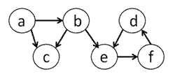
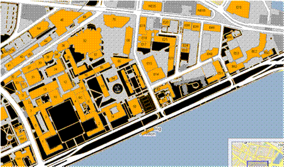
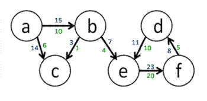
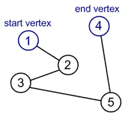
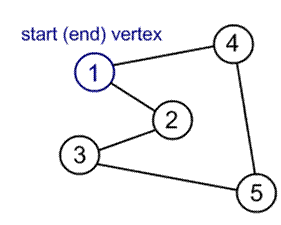

# Fastest Way to Get Around MIT

### Introduction

In this problem set you will write a solution to an optimization problem on how to find the
shortest route from one building to another on the MIT campus given you wish to constrain the
amount of time you will spend walking outdoors (because generally speaking, the nocturnal
beaver... err, the nocturnal MIT engineer... hates the sun).

### Getting Started

Download the files [here]:

[here]: http://ocw.mit.edu/courses/electrical-engineering-and-computer-science/6-00sc-introduction-to-computer-science-and-programming-spring-2011/unit-3/lecture-24-avoiding-statistical-fallacies/ps11.zip

* ps11.py: code skeleton
* graph.py: a set of graph-related data structures (Digraph, Node, and Edge) that you can use
* mit_map.txt: a sample data file that holds the information about an MIT campus map.

### Background

A graph consists of a set of nodes (n1, n2, n3, ....) and a set of edges (e1, e2, e3, ...) where an edge
connects two nodes that are in the graph. The node n1 has children nodes if there exists an edge
from n1 to each child node. In Figure 1, Node “a” has children nodes “b” and “c.”
There are two types of edges: directed and undirected. If the edge is directed, then the edge has a
specific direction going from start to destination node. Graphs with directed edges are called
directed graphs (or **digraph**).

*Figure 1. Example of a __directed__ graph where each edge has a specific direction.*

If the edge is undirected, also known as bidirectional, then it no longer matters which node is the
start or destination node because you can traverse the edge from one node to the other in either
direction. Essentially, a link in the graph can be represented by a directed edge going from Node
“d” to Node “e” and a directed edge going in the reverse direction.

*Figure 2. Example of an __undirected__ graph where each edge is bidirectional.*

An edge can also have a weight. If every edge is associated with a real number (edge weight),
then we have weighted graph.

*Figure 3. Example of a __weighted__ graph where each edge has a weight associated with it.*

In a graph theory problem, the **objective function** is the function to be minimized (or
maximized). For example, choosing the shortest path for airplane flights is an optimization
problem where the objective function is to minimize the distance traveled. The nodes are the
destination airports and edges are the presence of airplane routes between airports. We can add
additional **constraints** on the problem that must be satisfied such as requiring that the plane only
make at most 2 stops along the way from start to end destination. Then the shortest path is only
valid if it satisfies the constraint.

### Introduction

Here is the map of the MIT campus that we all know and love. From the text input file,
*mit_map.txt*, you will build a representation of this map in Python using the graph-related data
structures that we provide.

Each line in *mit_map.txt* has 4 pieces of data in it in the following order separated by a single
space (space-delimited): the start building, the destination building, the distance in meters
between the two buildings, and the distance in meters between the two buildings that must be
spent outdoors. For example, suppose the map text file contained the following line:

    10      32      200     40

This means that the map contains an edge from building 10 (start location) to building 32 (end
location) that is 200 meters long, where 40 of those 200 meters are spent outside.
To make the problem interesting, we will say that not every route between a pair of buildings is
bi-directional. For example, it may be possible to get from building 54 (Green building) to
building 56, but not the other way around, because the wind that blows away from the Green
building is too strong.

## Problem 1: Creating the Data Structure Representation

In this problem set, we are dealing with edges that have different weights. In the figure below,
the blue numbers show the cost of traversing an edge in terms of total distance traveled, while
the green numbers show the cost of traversing an edge in terms of distance spent outdoors. Note
that the distance spent outdoors for a single edge is always less than or equal to the total distance
it takes to traverse that edge. Now the cost of going from “a” to “b” to “e” is a total distance
traveled of 22 meters, where 14 of those meters are spent outdoors. These weights are important
when comparing multiple paths because you want to look at the weights associated with the
edges in the path instead of just the number of edges traversed.

In *graph.py*, you’ll find the Digraph, Node, and Edge classes, which do not store information
about weights associated with each edge.

Extend the classes so that it fits our case of a weighted graph. Think about how you can modify
the classes to store the weights shown above. Make modifications directly in graph.py. Hint:
subclass the provided classes to add your own functionality to the new classes. Deciding what
representation to use in order to build up the graph is the most challenging part of the problem
set, so think through the problem carefully.

## Problem 2: Building up the Campus Map

Decide how the campus map problem can be modeled as a graph. Write a description of your
design approach as a comment under the Problem #1 heading in ps11.py. What do the graph’s
nodes represent in this problem? What do the graph’s edges represent in this problem?

    # Problem 2:
    #
    # Write a couple of sentences describing how you will model the
    # problem as a graph)
    #

In the load_map function of ps11.py read in the building data from mapFilename and build a
directed graph to properly represent the MIT campus map (according to the file). Hint: read
[documentation] on file objects in order to figure out how to read each line of the text file. Then
parse each line with the help of string.split.

[documentation]: http://docs.python.org/tutorial/inputoutput.html#reading-and-writing-files
    
    def load_map(mapFilename):
        """
        Parses the map file and constructs a directed graph
        Parameters:
        mapFilename : name of the map file
        Assumes:
        Each entry in the map file consists of the following four
        positive integers, separated by a blank space:
        From To TotalDistance DistanceOutdoors
        e.g.
        32 76 54 23
        This entry would become an edge from 32 to 76.
        Returns:
        a directed graph representing the map
        """
        # TO DO

## Problem 3: Find the Shortest Path using Brute Force

We can define a valid path from a given start to end node in a graph as an ordered sequence of
nodes [n1, n2, ... nk], where n1 to nk are existing nodes in the graph and there is an edge from ni to
ni+1 for i=1 to k – 1. In Figure 4, each edge is unweighted, so you can assume that each edge is
length 1, and then the total distance traveled on the path is 4.

*Figure 4. Example of a path from start to end node.*

Note that a graph can contain cycles. A cycle occurs in a graph if the path of nodes leads you
back to a node that was already visited in the path. When building up possible paths, if you reach
a cycle without knowing it, you could get stuck indefinitely by extending the path with the same
nodes that have already been added to the path.

*Figure 5. Example of a cycle in a graph.*

In our campus map problem, the total distance traveled on a path is equal to the sum of all total
distances traveled between adjacent nodes on this path. Similarly, the distance spent outdoors
on the path is equal to the sum of all distances spent outdoors on the edges in the path.
Depending on the number of nodes and edges in a graph, there can be multiple valid paths from
one node to another, which may consist of varying distances. We define the shortest path
between two nodes to be the path with the least total distance traveled. In our campus map
problem, one way to find the shortest path from one building to another is to do exhaustive
enumeration of all possible paths in the map and then select the shortest one.

